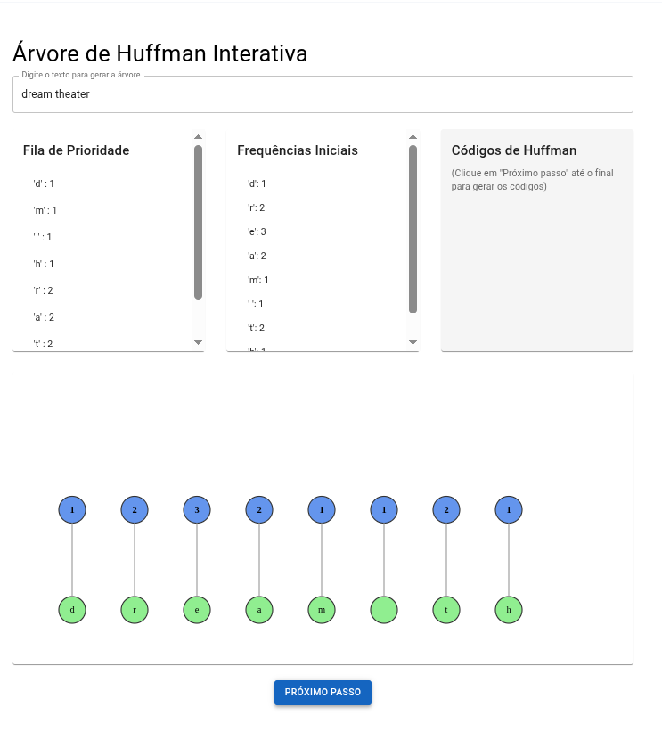
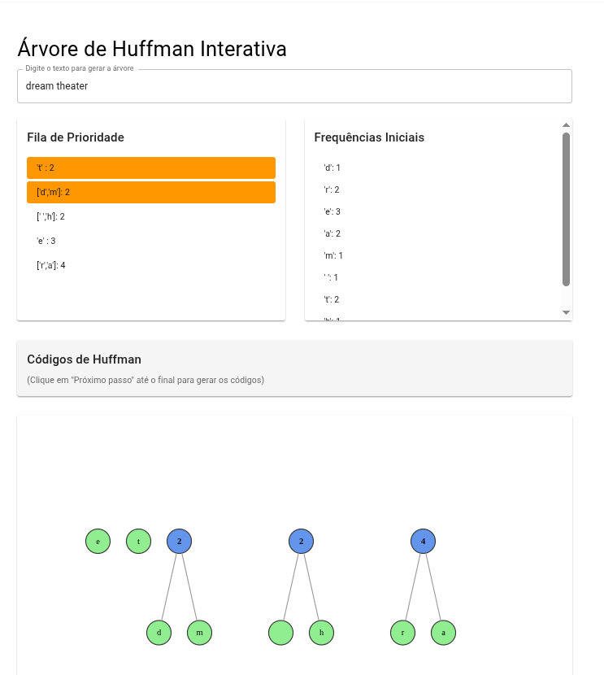
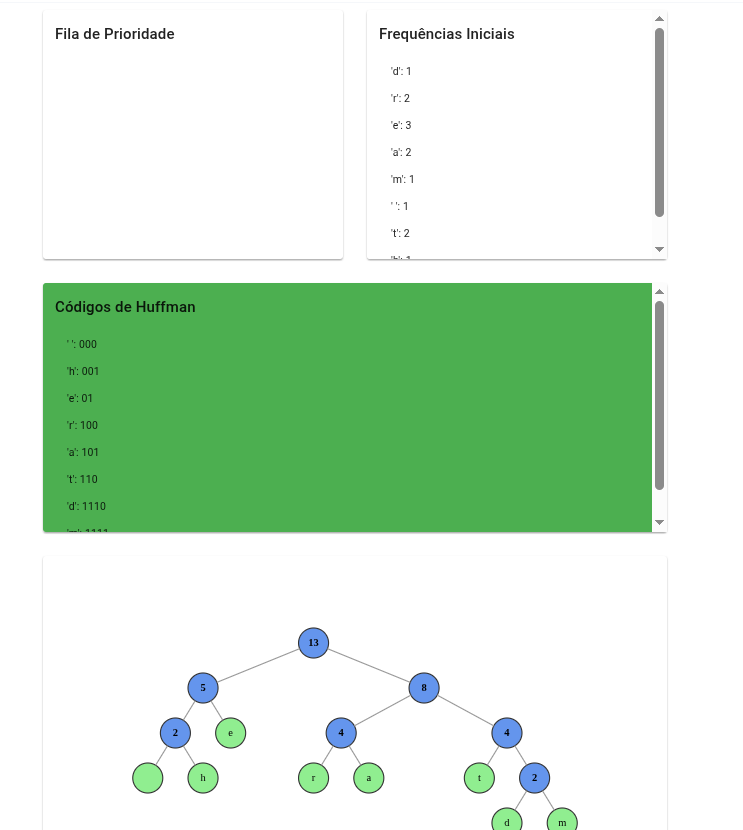

# algoritmosGulosos_Huffman

**Número da Lista**: X<br>
**Conteúdo da Disciplina**: Algoritmos Ambiciosos<br>
**Video da apresentação**: [algoritmosGulosos_Huffman](https://youtu.be/ZXEWLwLtZCQ)<br>

## Alunos
|Matrícula | Aluno |
| -- | -- |
| 211030694 | Caio Felipe Alves Braga |
| 211039617 | Maria Luisa Alves Rodrigues |

## Sobre  
Este projeto é uma aplicação interativa desenvolvida com **React**, utilizando as bibliotecas **@visx/hierarchy** e **Material UI**, como parte da disciplina de Projeto de Algoritmos.  
O objetivo é demonstrar visualmente a construção da **Árvore de Huffman**, algoritmo clássico de compressão de dados. O usuário pode acompanhar passo a passo a união dos nós e observar os **códigos binários gerados** para cada caractere do texto.

## Screenshots
<div style="display: flex; gap: 10px;">
  
  
  
</div>

## Tecnologias Utilizadas  
- **Linguagem**: JavaScript (React)  
- **Bibliotecas**:
  - [`@visx/hierarchy`](https://github.com/airbnb/visx): para renderização da árvore em SVG  
  - [`@mui/material`](https://mui.com/): para os componentes de interface  

### Pré-requisitos
- Node.js
- npm ou yarn instalados 

### Comandos para instalação
1. Clone o repositorio e acesse a pasta huffman-web

```bash
git clone https://github.com/projeto-de-algoritmos-2025/algoritmosGulosos_Huffman.git
cd algoritmosGulosos_Huffman/huffman-web
```
2. Instale as dependências
```bash
npm install
# ou
yarn install
```

3. Execute o projeto
```bash
docker compose up
```

## Uso
Tendo acessado a URL : http://localhost:5173/
1. Digite um texto no campo de entrada.

2. Clique em "Próximo passo" para iniciar a construção da árvore de Huffman.

3. A cada clique, dois nós com menor frequência serão combinados.

4. Após o último passo, os códigos binários correspondentes a cada caractere do texto serão exibidos.

